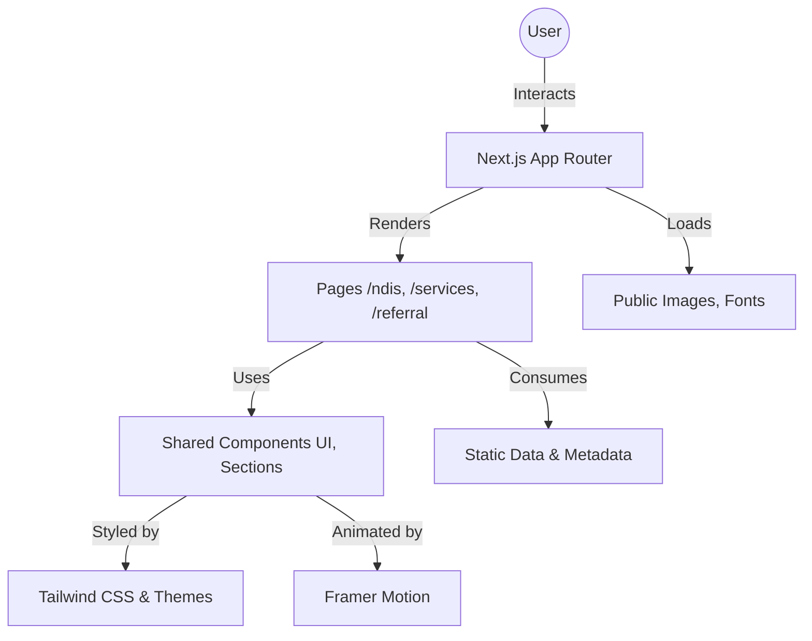

# Revira Care - Premium NDIS Support Services

Revira Care is a state-of-the-art web application built with Next.js, designed to provide comprehensive, accessible, and high-quality information about NDIS (National Disability Insurance Scheme) support services. The platform features a premium UI/UX, responsive design, and tailored imagery to empower individuals with disabilities and their families.

## 🌟 Key Features

- **Comprehensive NDIS Hub**: Dedicated sections for "Understanding NDIS", "New to NDIS", "Eligibility", and "NDIS Providers".
- **Specialized Service Pages**: Detailed information on In-Home Support, Social Participation, Group Activities, SIL, Life Skills, and SDA.
- **Premium Aesthetics**: Clean, modern design with glassmorphism, smooth animations (Framer Motion), and custom high-resolution imagery.
- **Responsive & Accessible**: Optimized for mobile, tablet, and desktop with a focus on ease of use.
- **Referral System**: Simple and effective referral form for participants and partners.
- **Theme Support**: Full support for Light and Dark modes.

## 🛠 Tech Stack

- **Framework**: [Next.js 15+](https://nextjs.org/) (App Router)
- **Styling**: [Tailwind CSS 4](https://tailwindcss.com/)
- **Animations**: [Framer Motion](https://www.framer.com/motion/)
- **Icons**: [Lucide React](https://lucide.dev/)
- **Language**: [TypeScript](https://www.typescriptlang.org/)
- **Deployment**: [Vercel](https://vercel.com/)

## 🏗 Architecture

The following diagram illustrates the high-level architecture and data flow of the Revira Care application:



## 📂 Project Structure

- `src/app/`: Contains the main page routes and layouts (Next.js App Router).
- `src/components/`: Reusable UI components and section-specific layouts.
- `public/images/`: Organized assets including optimized hero and service-specific images.
- `src/lib/`: Utility functions and helper methods.
- `src/styles/`: Global styles and Tailwind configuration.

## 🚀 Getting Started

To run this project locally, follow these steps:

### Prerequisites

- Node.js (Latest LTS recommended)
- npm or yarn

### Installation

1. **Clone the repository:**
   ```bash
   git clone [repository-url]
   cd Revira Care
   ```

2. **Install dependencies:**
   ```bash
   npm install
   ```

3. **Run the development server:**
   ```bash
   npm run dev
   ```

4. **Open the application:**
   Navigate to [http://localhost:3000](http://localhost:3000) in your browser.

## 🛠 Available Scripts

- `npm run dev`: Starts the development server.
- `npm run build`: Builds the application for production.
- `npm run start`: Starts the production server.
- `npm run lint`: Runs ESLint for code quality checks.

---

© 2026 Revira Care. All Rights Reserved.
